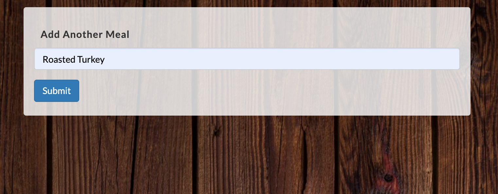
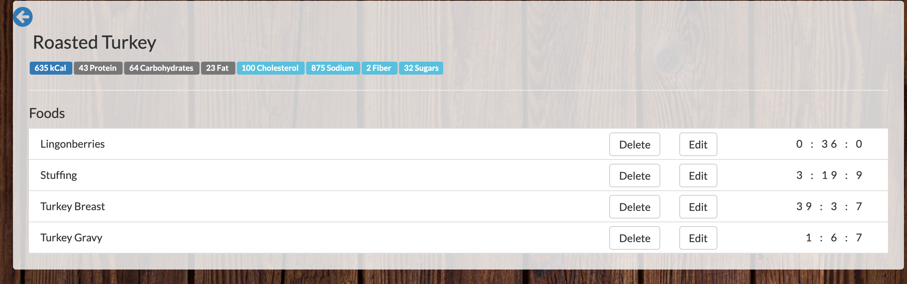
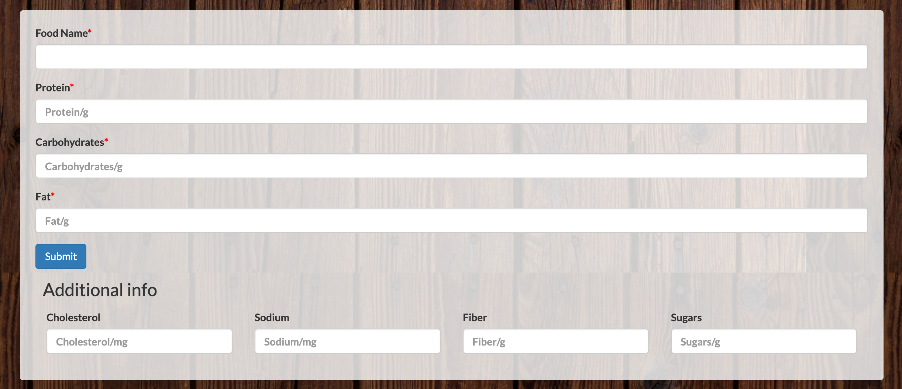
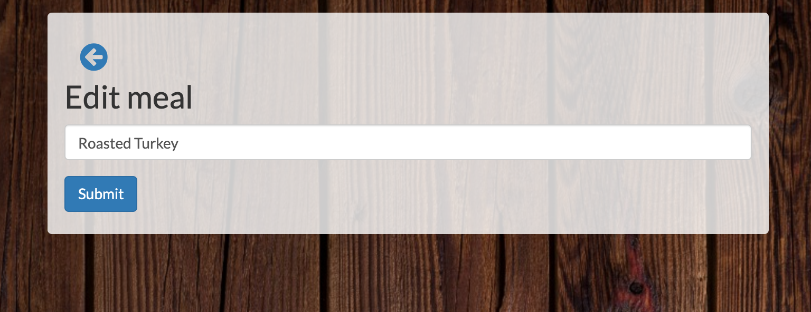
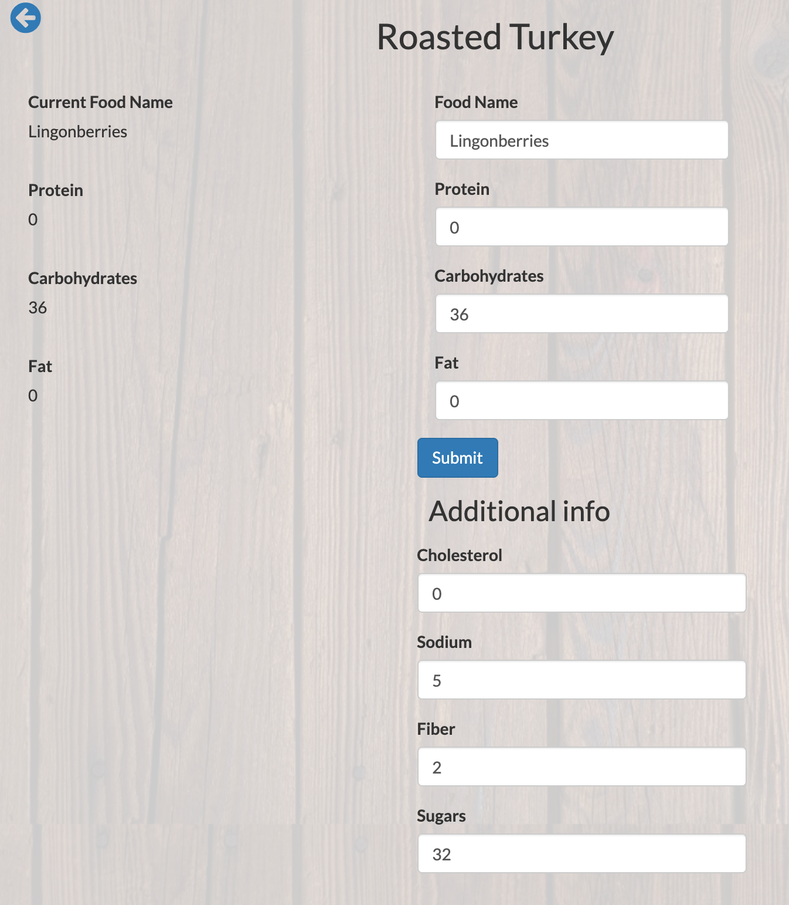
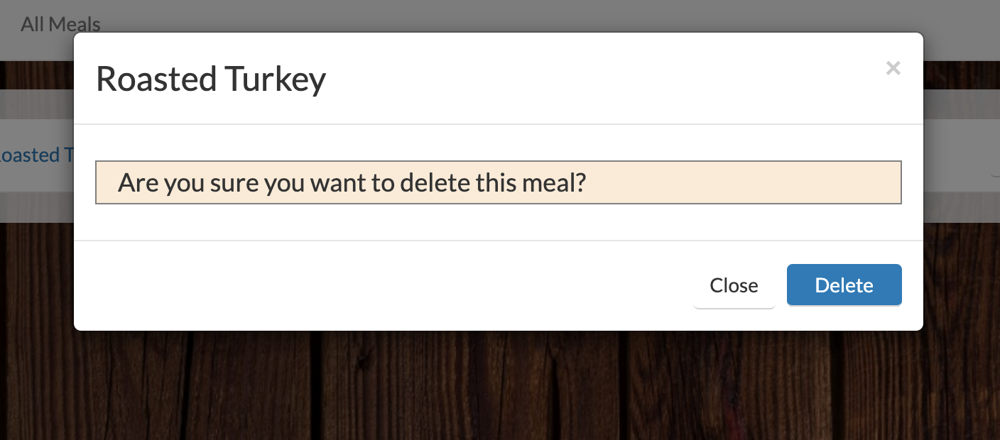
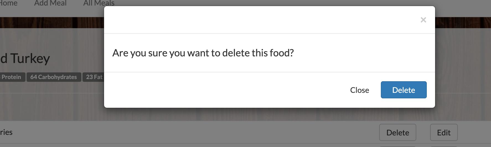

# MyFitnessBuddy

[Deployed version](https://my-fitness-buddy-ma.herokuapp.com/)

It's a lightweight calorie counter and tracker.

## Built with

1. Laravel
2. MySql
3. Bootstrap
4. Laravel Auth

### How it works

1. The app allow users to login to their accounts or create a new one.

2. The app offer users to create a meal.

3. Then users gonna add some info about their meal.

Such as amount of proteins, carbs, fats, cholesterol, sodium, fiber, sugars.

4. Users may also edit their meals and foods.

5. And delete a meal/food.

